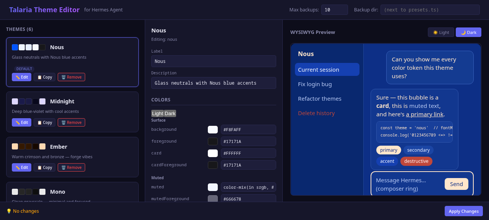
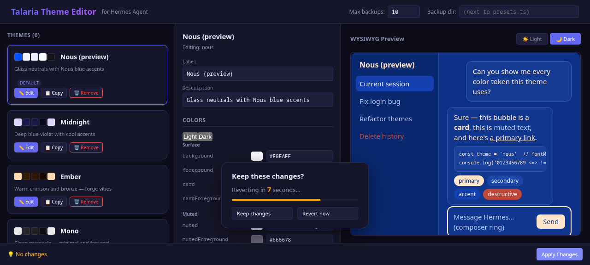

# Talaria Theme Editor

Standalone visual (WYSIWYG) editor for the
[Hermes Agent](https://github.com/nousresearch/hermes-agent) desktop theme
presets — runs entirely outside Hermes and touches nothing in `~/.hermes`
except `themes/presets.ts` (always backed up first as
`yyyyddmm-epoch-presets.ts`).

> **⚠️ Proof of concept.** This is a POC built for personal use and is not
> recommended for production. It rewrites your Hermes `presets.ts` (backups
> are taken on every save, but still — use at your own risk).

Created by Richard Ahlquist together with [Claude](https://claude.com/claude-code)
(Anthropic's Claude Code). Not affiliated with or endorsed by Nous Research.
Licensed under the [MIT License](LICENSE).

## Screenshots

The three-pane editor — theme list (left), grouped color/typography editor
(middle), and live WYSIWYG preview (right). Header holds the backup settings:



Applying an edit pops the keep/revert fail-safe — a 10-second countdown to
confirm the write (or it reverts the draft):



## Requirements

- **Node.js ≥ 20** (Vite 6 needs Node 18.18+/20/22+; 20+ recommended). Check with `node --version`.
- **npm** (bundled with Node). This project is npm-only — `pnpm`/`yarn` are not tested.

## Install & launch

```bash
git clone https://github.com/rahlquist/talaria-theme-editor.git
cd talaria-theme-editor
npm install                 # 1. install deps
npm run dev                 # 2. start the app (UI + editing API together)
```

Then open **http://localhost:5199** in your browser.

`npm run dev` is the *entire* app — the browser UI and the file-editing API
both run from the Vite dev server (the API is dev-server middleware, see
`vite.config.ts`). There is no separate backend process to start.

### esbuild post-install (if `npm run dev` errors)

This project transpiles `presets.ts` with **esbuild**, whose native binary
installs via a post-install script. Some setups (npm's `approve-scripts` gate,
restricted CI) block that script, and you'll get a "You installed esbuild for
another platform" / missing-binary error. Fix:

```bash
npm approve-scripts esbuild # allow the post-install, then re-run:
npm run dev
# …or force a rebuild of just the binary:
npm rebuild esbuild
```

### What it touches on disk

The editor reads and writes **one** file by default:

```
~/.hermes/hermes-agent/apps/desktop/src/themes/presets.ts
```

This path is currently hardcoded (`PRESETS_PATH` in `src/server/presets-io.ts`)
— there is no env var or CLI flag to repoint it. To edit a different copy of
`presets.ts`, temporarily move/merge it into that path, or edit the constant.
Every save first writes a timestamped backup
(`yyyyddmm-epoch-presets.ts`) in the same directory (or your chosen backup dir).

> **Caveat:** the editing API only exists while the Vite dev server is running.
> `npm run build` produces a static UI bundle in `dist/`, but that bundle has
> **no backend** — served on its own it cannot write `presets.ts`. Always use
> `npm run dev` for editing.

## Use

1. The **theme list** (left) mirrors Hermes' appearance settings — one card per
   theme in `presets.ts`, with a color swatch strip, Edit / Copy / Remove, and a
   `default` tag on the active skin. Click a card (or **Edit**) to select it.
2. The **editor** (middle) shows that theme's tokens grouped as
   Surface / Muted / Brand / Accent / Borders / Destructive / Sidebar / Bubbles,
   plus a Light/Dark toggle (only if the theme defines `darkColors`) and a
   Typography section (`fontSans` / `fontMono` stacks, `fontUrl` stylesheet).
   Each color uses the native picker + a text field that accepts **any** CSS
   color, including `color-mix(...)` and other computed values. "Add Optional
   Color" adds keys the theme doesn't define yet.
3. The **preview** (right) is a live WYSIWYG mock of a Hermes window painted
   from the selected theme's tokens (Light/Dark toggle). Font *size* is not part
   of `presets.ts`, so there is no zoom — the preview uses your default size.
4. Edit colors / label / description / fonts. Changed themes are tagged
   `edited` in the list and the Apply bar shows "N theme(s) edited".
5. **Apply Changes** (bottom bar) backs up `presets.ts` and writes your edits,
   then pops the **keep/revert** fail-safe: *Keep changes* confirms the edit,
   *Revert now* (or the **10-second** timeout) discards the in-memory draft and
   restores your pre-edit view. The disk write happens at Apply — the
   timestamped backup in the same folder (shown in the success message) is your
   recovery path if you revert. (The preview always shows the committed theme
   until you Apply.)
6. **Copy** on a card prompts for a new label + name (unique slug), then backs
   up `presets.ts`, writes the copy into it, and opens it in the editor.
7. **Remove** deletes a theme (after a confirm + backup). The last remaining
   theme can't be removed; removing the default repoints `DEFAULT_SKIN_NAME`
   to the first remaining one.
8. Header controls: **Max backups** caps how many `yyyyddmm-epoch-presets.ts`
   files are kept (oldest beyond the limit are pruned after each save; only
   files matching the backup pattern are ever touched). **Backup dir** sets
   where backups go (empty = next to `presets.ts`; `~` expands; created if
   missing). Both persist in the browser.

After saving, restart Hermes (or trigger its hot-reload) so it re-reads
`presets.ts`.

## Develop

- `npm install` — install dependencies (see esbuild note above).
- `npm test` — vitest; round-trip tests load/save against **temp copies** of a
  real `presets.ts`, so they never touch your live file. 19 tests.
- `npm run build` — strict `tsc --noEmit` typecheck + production bundle to
  `dist/`. (UI-only — see the caveat above; it cannot edit `presets.ts`.)
- `npm run dev` — the live app + editing API on http://localhost:5199.
- `REAPPLY.md` — how to re-sync with future Hermes versions and wire the editor
  into Hermes' own menu. `checkpoints/` — per-phase build log.
